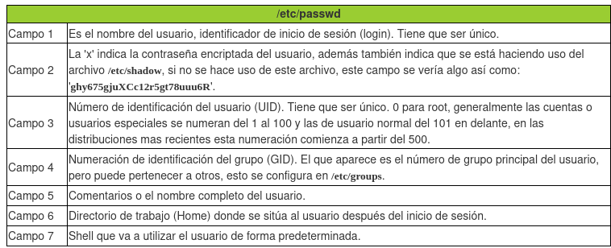
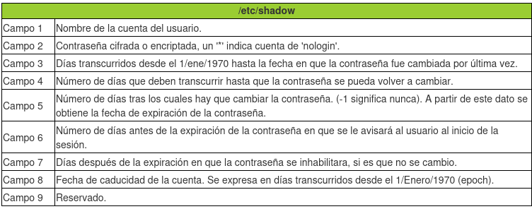
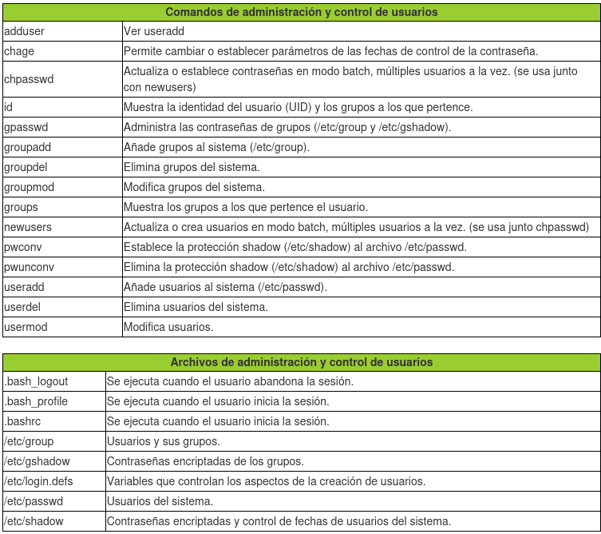

<h1>USERS MANAGEMENT </h1>

<ul>
    <li><a href="#user_types">User types</a></li>
    <li><a href="#users_group_files">user and group files</a></li>
    <li><a href="#users_managing">Users managing</a></li>
    <li><a href="#groups_managing">Groups managing</a></li>

</ul>

<h1 id="user_types">Tipos de usuarios </h1>

<strong>root</strong> -> user with all privilegies and have responsabilities like maintenance, user managment and installing software

<strong>special users</strong> -> users generated by the sistem for example bin, daemon, adm, lp, sync, shutdown, mail, operator, squid, apache, these users have UIDs from 1 to 100
or 1 to 500

<strong>normal users</strong> -> individual users

<h1 id="users_group_files">User and group files</h1>

<h2>/etc/passwd</h2>

file that contains all of the users in the system, every line correspond to a user, for example

<code>tom:x:1000:1000:tom,,,:/home/tom:/bin/bash</code>

<h2>/etc/shadow</h2>

this file contains user's encrypted passwords and another info about this passwords, for example

<code>tom:$y$j9T$W5a/lDT9foUTkhtSyquIV1$IynJpwY2Ag8vq/bEFbwb0QETYqR/Z9arP3zT6IQBgV2:20023:0:99999:7:::</code>

nota: values in shadow are defined in /etc/login.defs

<h2>/etc/group</h2>

each line in the file shows the relation of a user with every group it belongm for example

<pre>
root:x:0:root
ana:x:501:
sergio:x:502:ventas,supervisores,produccion
cristina:x:503:ventas,sergio
</pre>

<pre>
El campo 1 indica el usuario.
El campo 2 'x' indica la contraseña del grupo, que no existe, si hubiera se mostraría un 'hash' encriptado.
El campo 3 es el Group ID (GID) o identificación del grupo.
El campo 4 es opcional e indica la lista de grupos a los que pertenece el usuario
</pre>

<h1 id="users_managing">Users managing</h1>

<h2>create new user</h2>

useradd [user]

<h2> modify user</h2>

usermod -[OPTION] [user]

<pre>
-c añade o modifica el comentario, campo 5 de /etc/passwd
-d modifica el directorio de trabajo o home del usuario, campo 6 de /etc/passwd
-e cambia o establece la fecha de expiración de la cuenta, formato AAAA-MM-DD, campo 8 de /etc/shadow
-g cambia el número de grupo principal del usuario (GID), campo 4 de /etc/passwd
-G establece otros grupos a los que puede pertenecer el usuario, separados por comas.
-l cambia el login o nombre del usuario, campo 1 de /etc/passwd y de /etc/shadow
-L bloque la cuenta del usuario, no permitiendolé que ingrese al sistema. No borra ni cambia nada del usuario, solo lo deshabilita.
-s cambia el shell por defecto del usuario cuando ingrese al sistema.
-u cambia el UID del usuario.
-U desbloquea una cuenta previamente bloqueada con la opción -L.
</pre>

<h2>delete user</h2>

userdel -[OPTION] [user]

<pre>
-r -> deleted user and olso it's home directory
-f -> do the same of f but it can deleted a user even if it is logged
</pre>

<h2>cahnge password</h2>

passwd [user]

<pre>
-l -> block user
-u -> unblock user
</pre>

<h1 id="groups_managing">Groups managing</h1>

<h2>create group</h2>

groupadd -g group-id group-name

<h2>add a user to a group</h2>

usermod -aG goup1,group2 user

<h2>delete group for a user</h2>

usermod -G goup1,group2 user

<h2>check who is member of a group</h2>

getent group goup-name or check /etc/group

## configuraton files

<pre>
<strong>.bash_profile</strong> aquí podremos indicar alias, variables, configuración del entorno, etc. que deseamos iniciar al principio de la sesión.

<strong>.bash_logout</strong> aquí podremos indicar acciones, programas, scripts, etc., que deseemos ejecutar al salirnos de la sesión.

<strong>.bashrc</strong> es igual que <strong>.bash_profile</strong>, se ejecuta al principio de la sesión, tradicionalmente en este archivo se indican los programas o scripts a ejecutar, a diferencia de <strong>.bash_profile</strong> que configura el entorno.
</pre>
## brief and another commands

references: https://www.linuxtotal.com.mx/index.php?cont=info_admon_008
